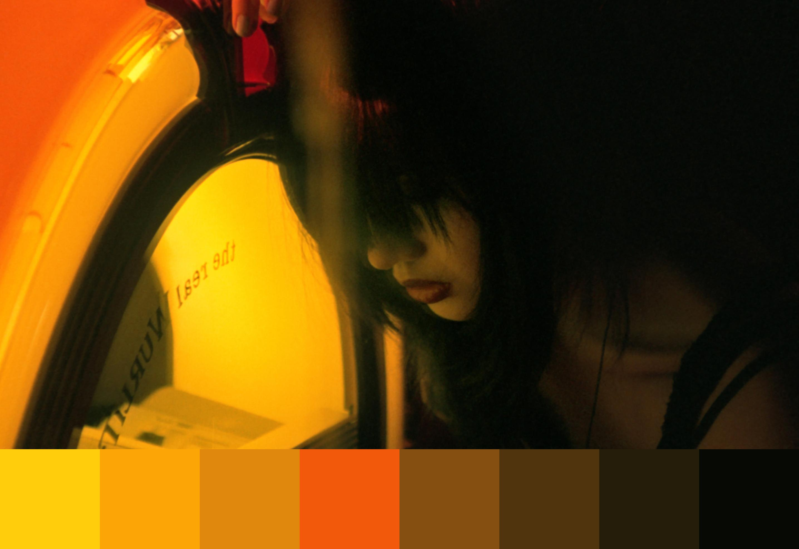
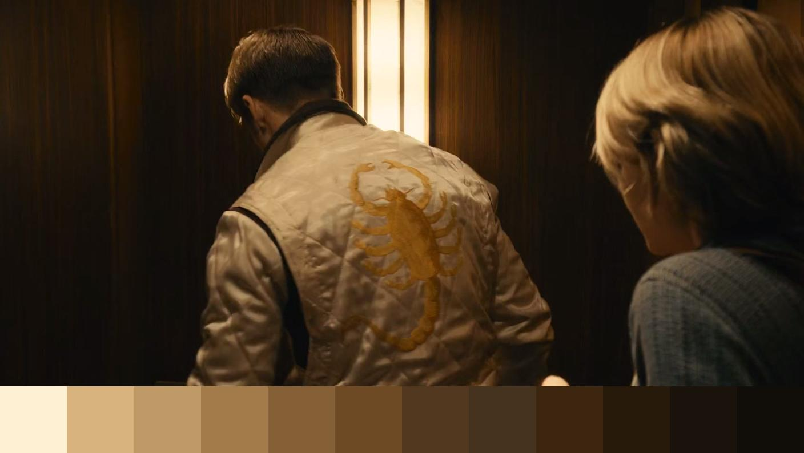
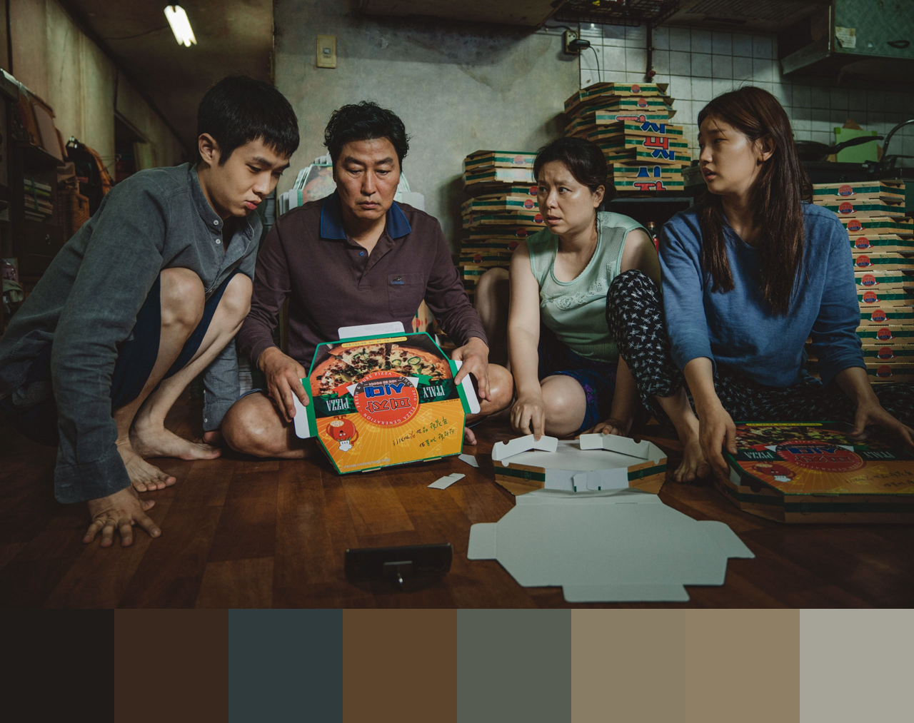
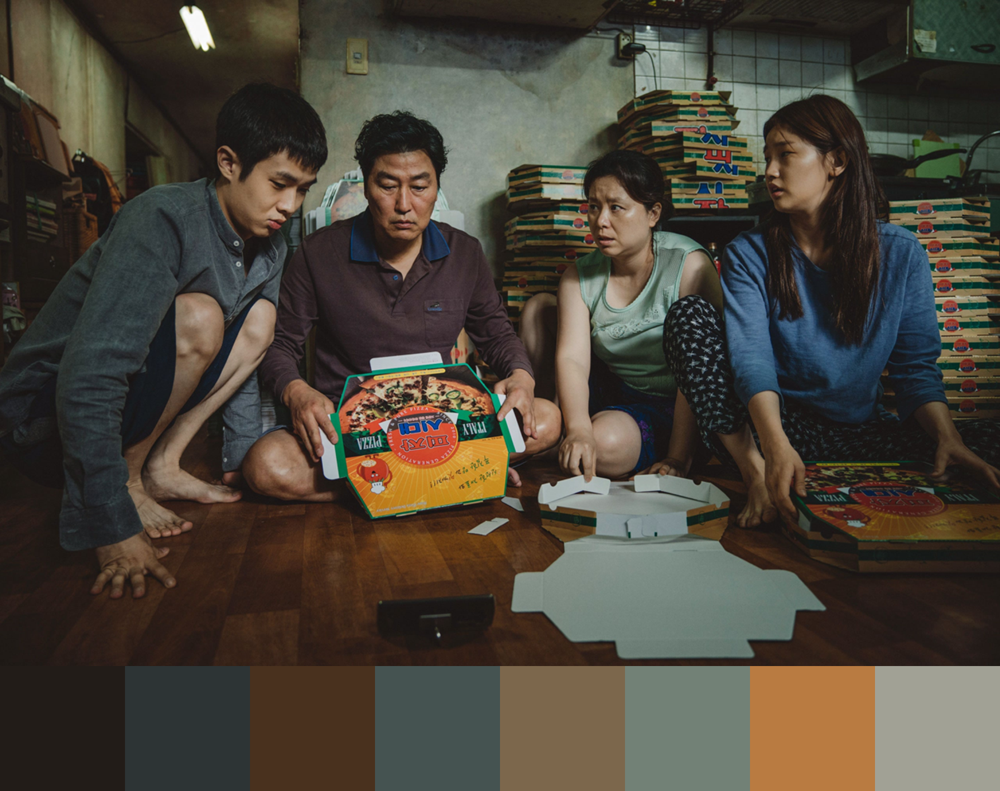
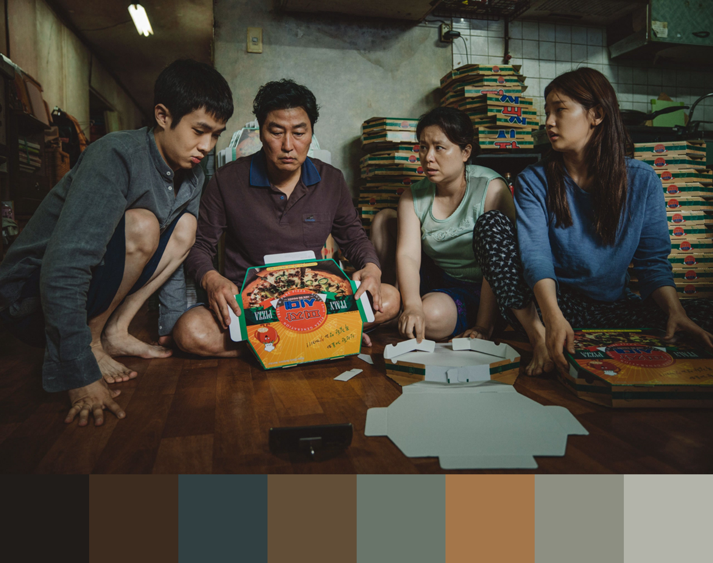
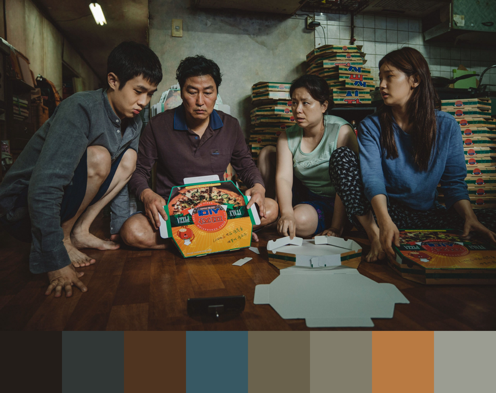

# Color Palette Generator (Work in Progress)

Trying out K-Means Clustering to generate color palettes from images. Logging my experiments. I'd like to deploy this as a web app once I'm happy with the results.

## Experimental Results

### K-Means Clustering (Ensemble of K-Means and MiniBatchKMeans)

Palette Sorted by Luminance

- *k* = 8

Still from *Chungking Express* (1994) by Wong Kar-Wai
- *k* = 8

Still from *Fallen Angels* (1995) by Wong Kar-Wai
- k = 12

Still from *Drive (2011)* by Nicolas Winding Refn

### Randomly Sampled Colors from Larger Number of Clusters

Stills from *Parasite (2019)* by Bong Joon-ho

- *k* = 36

- *k* = 36, 8 random colors are selected for palette

- *k* = 36, full palette

- *k* = 1, but image was segmented into 36 regions to generate palette

### Effect of Scale on Palette

K-Means Clustering (Ensemble of K-Means and MiniBatchKMeans)

*k* = 8

- Scaling Factor = 0.5

- Scaling Factor = 0.6

- Scaling Factor = 0.7

- Scaling Factor = 0.8

- Scaling Factor = 0.9

