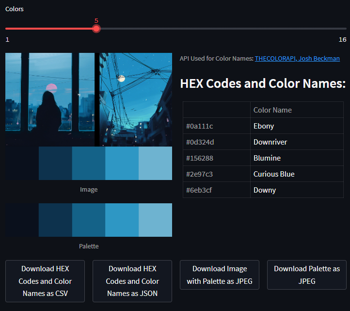
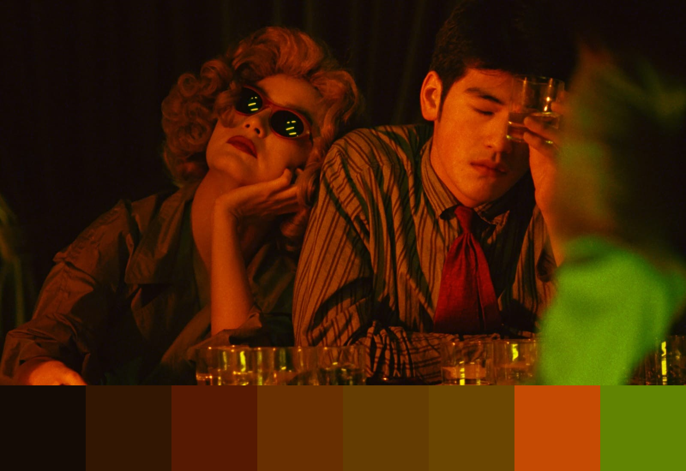
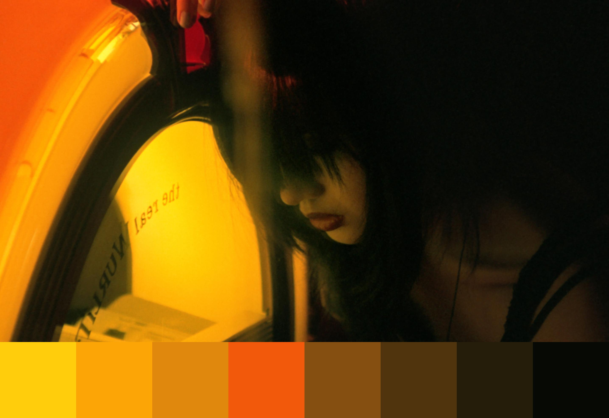
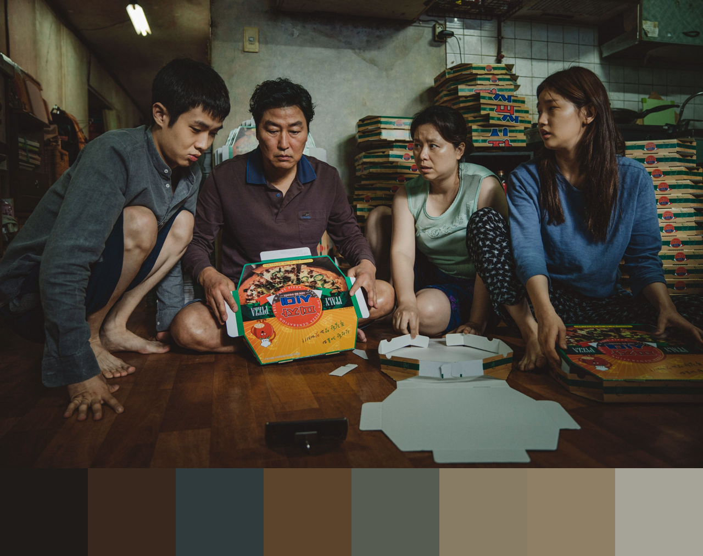
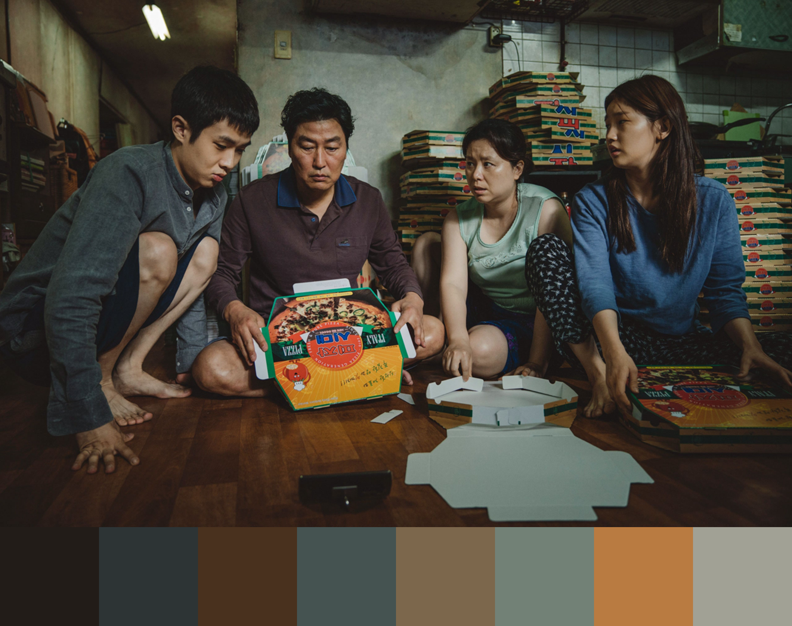
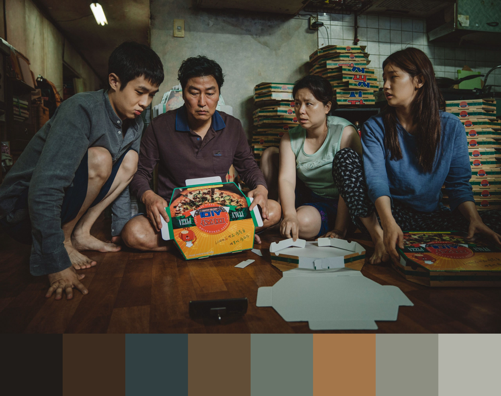
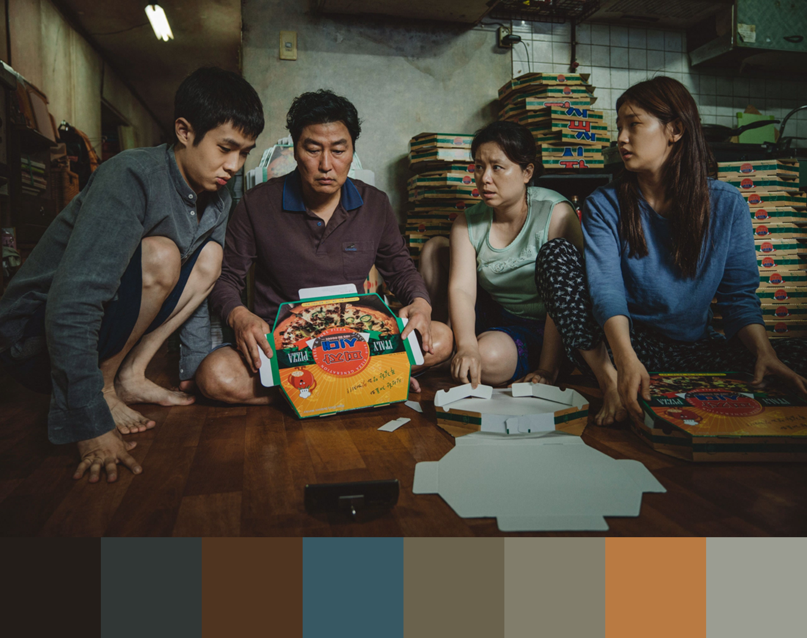
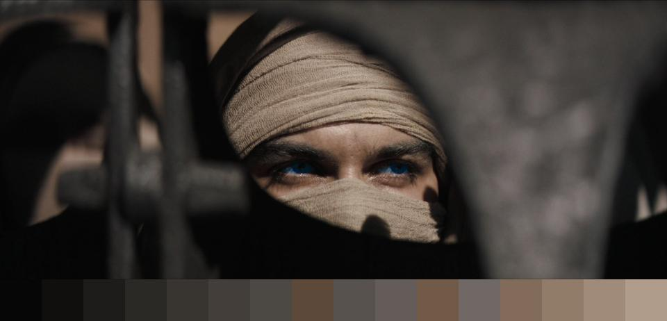
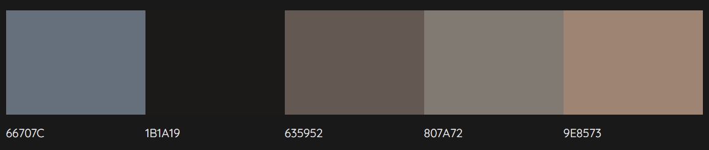

# Color Palette Generator

My goal with this project was an end-to-end machine learning project, and although I admit when I found out about [Colormind](http://colormind.io) I almost gave up on this, they're using deep GANs, I was gonna use K-Means, but I decided to go through with it anyway even though it's not deep learning so not cool by definition, my simple app lives on.

A deep Generative Adverserial Network is on my list of things to try next.

## Web App

The app is deployed on Streamlit. You can try it [here.](https://a-tabaza-color-palette-generator-app-erznb7.streamlit.app)

 I used [Intel® Extension for Scikit-learn](https://intel.github.io/scikit-learn-intelex/) to optimize my app since it trains a model for each picture the user uploads, I'm satisfied with the results, the app is fast and responsive.

## Experimental Results

### K-Means Clustering (Ensemble of K-Means and MiniBatchKMeans)

Still from *Chungking Express* (1994) by Wong Kar-Wai

Palette Sorted by Luminance

*k* = 8

Still from *Fallen Angels* (1995) by Wong Kar-Wai

*k* = 12

Still from *Drive (2011)* by Nicolas Winding Refn

Randomly Sampled Colors from Larger Number of Clusters

Stills from *Parasite (2019)* by Bong Joon-ho

*k* = 36

*k* = 36, 8 random colors are selected for palette

*k* = 36, full palette

*k* = 1, but image was segmented into 36 regions to generate palette

 Effect of Scale on Palette 

K-Means Clustering (Ensemble of K-Means and MiniBatchKMeans)

Stills from *Parasite (2019)* by Bong Joon-ho

*k* = 8

Scaling Factor = 0.5

Scaling Factor = 0.6

Scaling Factor = 0.7

Scaling Factor = 0.8

Scaling Factor = 0.9

## Conclusions

The range of colors is limited and sorted by dominance as opposed to prominence in image. Take this image for example, the palette should include the color of the pupils, but it doesn't even when I use 16 clusters.

For reference, the palette generated by Colormind is shown below, although it took a couple of random generates, it did detect the pupil color, which is what I'd like my model to achieve.

Still from *Dune (2021)* by Denis Villeneuve

